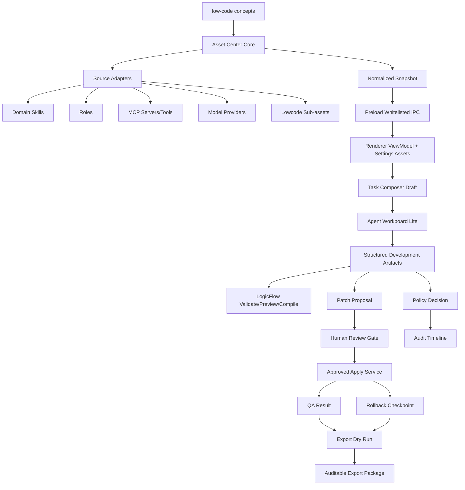

# Low-code Builder x FishSwarm Master Development Plan（10-Agent Integrated Edition）

> **For Claude / Codex:** REQUIRED SUB-SKILL: Use `executing-plans` to implement this plan task-by-task.  
> **计划日期:** 2026-06-25  
> **工作区:** `D:\myProject\FishSwarm`  
> **当前分支:** `codex/lowcode-fishswarm-comprehensive-integration`  
> **当前基线:** `3042a4c feat: add asset export dry run service`  
> **旧总计划:** `D:\myProject\FishSwarm\docs\plans\2026-06-24-lowcode-fishswarm-comprehensive-development-plan.md`

**Goal:** 在现有 FishSwarm 页面布局和产品定位基础上，完整融合 Lowcode 的资产中心、组件蓝图、逻辑/流程设计、数据模型、接口集成、源码导出能力，最终形成一个“资源库 / Assets + 多角色 Agent 工作流 + 结构化开发 Artifact + 人审 Diff + QA + 回滚 + 可审计导出包”的 AI Agent 桌面开发工作台。

**Architecture:** 采用“只读资产索引 → 资源库 UI → Lowcode 子资产入库 → Agent Workboard Lite → Role × Artifact 闭环 → LogicFlow 预览 → Policy/Audit 强制治理 → Export Dry Run → 受控动作 → 导出打包 → 文档/发布”的分层演进。Renderer 保持展示与任务草稿职责；所有写入、导出、apply、install、run 都必须走 main process、policy decision、human gate、audit event 和 rollback checkpoint。

**Tech Stack:** Electron、TypeScript、React、Vite、Vitest、Zustand、Node fs/path/crypto、existing FishSwarm roles/runtime、skills manager、MCP config、workflow artifact store、permission rules、i18n、Tailwind/CSS tokens、electron-builder。

---

## 0. 本计划如何产生

本计划整合了 10 个只读审阅智能体视角：

| # | 智能体视角 | 核心结论 |
|---|---|---|
| 1 | 产品与最终效果 | FishSwarm 不做低代码 IDE clone，而做 AI Agent 资源化工作台；资源库不能只藏在 Settings，至少要在首页/入口可见。 |
| 2 | 架构与模块边界 | 明确 Shared Contract、Main Domain、Governance、Preload IPC、Renderer ViewModel 五层；Policy/Audit 长期应从 Asset Center 解耦为治理层。 |
| 3 | Asset Center / 资源库 | Asset Center 核心、adapter、只读 IPC、SettingsAssets UI、Lowcode 子资产、MCP tool 引用、i18n 文案已完成到 Beta。 |
| 4 | 多角色/多智能体编排 | Lowcode 应作为资源与结构化 artifact 进入多角色体系；关键缺口是 Agent Workboard Lite 和 Role 输出到 artifact 的闭环。 |
| 5 | 前端 UI/UX | 当前布局可保留；新功能优先放 Settings；Welcome 应加“从模板开始”入口，资源库需要可访问性、中文文案、只读安全提示。 |
| 6 | 安全/权限/审计 | Policy/Audit 目前只是模型，未强制接入；apply/export 不能开放，直到 approval、hash、路径、审计、rollback 全链路完成。 |
| 7 | 测试与质量工程 | 现有 Vitest 是 node 环境，`.tsx` UI 测试策略不足；M8-M10 需要补 Controlled Actions、Export Package、安全回归。 |
| 8 | 发布/导出/打包 | asset export 已覆盖 dry-run、createPackage、UI、release note、checksum/provenance/redaction 报告。 |
| 9 | TDD 任务拆解 | 当前已到 M7；下一步应从安全 useInTask、结构化 prompt、provider configure、patch review view model 等小提交推进。 |
| 10 | 运营文档/用户手册/演示 | README/ROADMAP 叙事不统一；需要 docs/user、docs/developer、docs/demos、docs/assets、release notes。 |

---

## 1. 产品最终形态

FishSwarm 的正确终局不是 low-code desktop runtime 式低代码 IDE，而是：

> **一个以资源为起点、以多角色 Agent 为执行组织、以结构化 Artifact 为过程资产、以人审和审计为安全边界的桌面 AI 开发工作台。**

用户最终主路径：

```text
启动 FishSwarm
  -> 首页“从模板开始 / Start from template”
  -> 资源库 / Assets
  -> 选择模板 / 角色 / Skill / MCP / Provider / 组件蓝图 / Workflow
  -> 插入任务草稿，不自动执行
  -> 多角色 Agent 生成结构化方案 Artifact
  -> 预览 Feature Blueprint / Data Model / Component Tree / LogicFlow
  -> 生成 Patch Proposal
  -> 人审 Diff + Secret Scan + Risk Summary + Allowed Paths + Diff Hash
  -> 批准后受控 Apply
  -> Apply 前自动 Rollback Checkpoint
  -> Apply 后 QA Result / Release Summary
  -> Export Dry Run
  -> 无 blocker + 人审后 Create Export Package
```

普通模式只展示模板、自然语言、确认按钮和风险提示；高级模式展示 artifact timeline、diff hash、manifest、checksum、rollback、audit event。

## 2. 当前状态与差距

### 2.1 已完成能力

| 区域 | 已有文件/证据 | 状态 |
|---|---|---|
| Asset Center Core | `src/main/asset-center/*` | 已有类型、concept map、domain/built-in/provider/MCP/plugin/role/workflow adapters、snapshot service |
| Read-only IPC | `src/main/index.ts`、`src/preload/index.ts`、`src/tests/asset-center/asset-center-ipc-contract.test.ts` | 已暴露 `assetCenter.getSnapshot`，测试禁止 install/run/export/apply |
| Resource Library UI | `src/renderer/components/settings/SettingsAssets.tsx`、`src/renderer/utils/asset-center-view-model.ts` | 已有 Settings 页、搜索、筛选、详情、warnings |
| Structured Artifacts | `src/shared/development-artifact-types.ts`、`src/main/planning/*` | 已有 patch proposal、human gate、rollback checkpoint、approved apply 基础服务 |
| LogicFlow Preview | `src/shared/logic-flow-types.ts`、`src/main/logic-flow/*` | 已有 types、schema、compiler，尚无 UI/资产入口 |
| Policy/Audit Model | `src/main/asset-center/asset-policy-*`、`asset-audit-types.ts` | 有类型和 stub，未强制接入执行链 |
| Export Dry Run / Package | `src/main/release/asset-export-*`、`src/renderer/components/release/*`、`src/tests/release/*` | 已有 types、rules、dry-run、createPackage、UI 与 package tests |

### 2.2 P0 已知问题

1. `src/main/asset-center/lowcode-concepts.ts` 已有测试覆盖，当前不含 `????`；
2. `src/renderer/i18n/locales/zh.json` / `en.json` 已补齐 `settings.assets`、`assetCenter`、`assetExport` 与 Welcome 入口文案；
3. `src/main/logic-flow/logic-flow-compiler.ts` 默认 `conceptRefs` 为 `lowcode-concept:logic-flow`，但当前 concept key 是 `logic-design`；
4. `src/main/asset-center/asset-center-types.ts` 与 `src/shared/ipc-types.ts` 存在相似 Asset 类型，长期可能漂移；
5. `AssetCenterItem.actions` 仍是字符串数组，未来 action 误开放风险高；
6. `workflowArtifacts.list(payload.cwd)` 类能力需要重新审查任意 cwd 和敏感 artifact 泄露风险；
7. `applyApprovedPatch()` 需要补 `allowedActions`、`allowedPaths`、baseCommit、dirty/file hash 校验；
8. `createPatchProposalArtifact()` 对含 secret 的 diff 不能明文落 artifact；
9. rollback checkpoint 不能默认抓全工作树 dirty diff；
10. export denylist/size cap/audit 已支撑 createPackage；后续继续扩大 redaction pattern 与策略审计覆盖。

## 3. 架构设计



五层边界：

| 层 | 目录 | 负责 | 不负责 |
|---|---|---|---|
| Shared Contract | `src/shared` | IPC 类型、Artifact 类型、LogicFlow 类型、Export 类型 | 文件扫描、UI 状态、业务 IO |
| Main Domain/Application | `src/main/asset-center`、`planning`、`logic-flow`、`release` | 扫描、聚合、校验、preview、dry-run、apply 服务 | React UI、直接 renderer 写入 |
| Governance | 短期在 `asset-center`，长期迁到 `src/main/governance` | policy、audit、approval correlation、风险事件 | 资产扫描实现细节 |
| Preload IPC | `src/preload/index.ts` | 白名单领域 API | generic invoke、shell、fetch、任意路径 open |
| Renderer ViewModel/UI | `src/renderer` | 展示、筛选、任务草稿、确认 UI | 文件写入、shell、真实导出、真实 apply |

关键 ADR 补充：

- ADR-005：Preload 只暴露领域化白名单 IPC；
- ADR-006：Policy/Audit 作为 Governance 横切模块；
- ADR-007：Asset Action 从字符串演进为 descriptor；
- ADR-008：Renderer 只消费 ViewModel/DTO；
- ADR-009：Snapshot 缓存与 adapter 隔离；
- ADR-010：LogicFlow 永远不直接执行。

## 4. 非功能要求 NFR

### 安全

- Asset snapshot、UI detail、export preview 不得包含 API key、token、cookie、private key；
- 所有 install/run/export/apply/createPackage 都必须经过 policy decision；
- 所有写操作必须写 audit event；
- patch apply 必须绑定 exact diff hash、approval、allowedActions、allowedPaths；
- approval 过期、rejected、hash mismatch、baseCommit mismatch、dirty mismatch 时不得 apply；
- blocked secret diff 不得明文持久化；
- rollback checkpoint 只捕获目标/允许路径，不抓全工作树；
- Renderer 不新增 shell/fetch/file 泛桥接。

### 性能

| 指标 | 目标 |
|---|---|
| Asset snapshot | 100 domain skills 下 p95 < 500ms |
| 资源库首屏 | p95 < 1s |
| 本地搜索/筛选 | p95 < 100ms |
| Export dry-run | 1000 文件内 p95 < 3s |
| Adapter 失败处理 | 单 adapter 失败不影响其他结果 |

### 可维护性

- 每个 source adapter 独立测试；
- 每个危险动作独立 IPC contract test；
- ViewModel 与 UI 分离；
- 不继续膨胀 `src/main/index.ts`，新 IPC 后续拆 registrar；
- 每个 commit 保持单一目的。

---

## 5. 核心数据契约

### 5.1 Asset envelope

必须稳定包含：`id`、`kind`、`source`、`scope`、`status`、`title`、`summary`、`tags`、`sourceRef`、`schemaVersion`、`updatedAt`、`contentHash`、`credentialRefs`、`policyRefs`、`lineageRefs`、`actions`、`warnings`。

### 5.2 Asset kinds 分组

| 组 | kinds |
|---|---|
| 创作起点 | `concept.lowcode`、`prompt.template`、`component.blueprint`、`workflow.template`、`dataModel.draft` |
| 能力与连接 | `skill.domain`、`skill.builtIn`、`role`、`mcp.server`、`mcp.tool`、`plugin`、`ai.provider`、`ai.modelPreset`、`ai.providerSetup` |
| 交付与审计 | `workflow.artifact`、`patch.proposal`、`review.gate`、`qa.result`、`rollback.checkpoint`、`export.package` |

### 5.3 Development artifact lineage

每个结构化开发 artifact 必须包含：`schemaVersion`、`parentArtifactIds`、`sourceRefs`、`roleRefs`、`assetRefs`、`conceptRefs`、`sessionId`、`taskBoardId`、`createdBy`、`contentSha256`、`allowedPaths`、`deniedPaths`、`reviewState`。

### 5.4 Patch / Review / Export 不变量

- `PatchProposal.diffSha256` 必须覆盖实际 diff；
- blocker secret diff 不得明文保存；
- `HumanReviewGate.approvedDiffSha256` 必须匹配 proposal；
- `HumanReviewGate.allowedActions` 必须包含 `patch.apply`；
- `allowedPaths` 只能等于或收窄 proposal；
- export package 必须包含 `manifest.json`、`checksums.sha256`、`redaction-report.json`、`provenance.json`、`source/`、`artifacts/`、`README.md`。

---

## 6. UI / UX 计划

### 6.1 Settings Assets 页面

保持当前 Settings 页面作为首要展示入口：

```text
SettingsAssets
├─ Header：资源库 / Assets + Refresh
├─ Security Hint：只读/不会执行/不会写文件
├─ Stats：总数、warnings、按组计数
├─ Search & Filters：keyword、group、kind、source、status
├─ Group Chips：创作起点 / 能力与连接 / 交付与审计
├─ Asset Grid/List
└─ Detail Panel
   ├─ metadata
   ├─ source/provenance
   ├─ warnings
   ├─ safe actions
   ├─ preview
   ├─ patch review panel（后续）
   └─ export dry-run panel（后续）
```

### 6.2 Welcome 轻入口

新增但不破坏布局：

- “从模板开始 / Start from template”；
- 点击只执行 `setSettingsTab('assets') + setShowSettings(true)`；
- 不自动选择资源；
- 不自动提交 prompt。

### 6.3 Composer 中的资产引用

Use in Task 后只插入结构化引用，例如：

```text
[FishSwarm Asset Reference]
assetId: role:product-strategist
kind: role
title: Product Strategist
source: built-in
intent: useInTask
summary: ...
```

UI 上可先作为文本块，后续升级为 chip。提交前不触发模型或工具。

### 6.4 Patch Review UI

`PatchReviewPanel` 必须展示 patch proposal id、文件列表、diff hash、base commit、dirty hash、risk summary、secret scan、allowed/denied paths、approve/reject、apply 可用性。

### 6.5 Export UI

`AssetExportDryRunPanel` 必须展示 include/exclude rules、candidate files、blockers、warnings、redaction report、manifest preview、checksum preview。`createPackage` 仅 dry-run 无 blocker + approval 通过后可用。

---

## 7. 开发路线总览（重新校准）

当前旧计划的 M0-M7 基本已实现到 dry-run。新计划不重复已完成工作，而从“校准现状 + 安全补强 + 受控动作 + Workboard + 导出包 + 文档发布”继续。

| 新 Milestone | 名称 | 目标 | 状态 |
|---|---|---|---|
| M0 | 状态校准与 P0 修复 | 修乱码、conceptRef、action guard、类型漂移记录 | 已完成 |
| M1 | Lowcode 子资产入库 | 将 component-blueprints、examples、scripts、LogicFlow templates 作为资产 | 已完成 |
| M2 | Resource Library UX 完善 | 修 i18n、scope 显示、Welcome 入口、只读 action guard、可访问性 | 已完成 Beta |
| M3 | Safe Use in Task / Configure | 资产插入任务草稿、Provider 跳设置，不执行 | 已完成 |
| M4 | Agent Workboard Lite | 角色、资产、artifact、审批进入可见任务板 | 已完成 Beta foundation |
| M5 | Role × Artifact 闭环 | 多角色产出 feature/data/component/logic/api/patch artifact | 已完成基础 linker |
| M6 | Planning Security Hardening | patch proposal、gate、rollback、apply 安全补强 | 已完成 Beta hardening |
| M7 | Patch Review UI | 人审 diff 和 rollback checkpoint 只读/受控 UI | 已完成 |
| M8 | Export Package Creation | 从 dry-run 到 createPackage 核心服务 | 已完成 |
| M9 | Export UI + Release Flow | 导出 UI、release notes、包验收 | 已完成 |
| M10 | Docs / Demos / Hardening | 用户/开发者文档、演示脚本、安全回归、最终发布 | 已完成 foundation |

---

# 8. 详细任务计划

## Milestone 0: 状态校准与 P0 修复

### Task 0.1: 修复 Lowcode 概念和中文设置文案

**Files:**

- Modify: `D:\myProject\FishSwarm\src\main\asset-center\lowcode-concepts.ts`
- Modify: `D:\myProject\FishSwarm\src\renderer\i18n\locales\zh.json`
- Modify: `D:\myProject\FishSwarm\src\renderer\i18n\locales\en.json`
- Test: `D:\myProject\FishSwarm\src\tests\asset-center\lowcode-concepts.test.ts`

**Steps:** 写测试断言所有 concept 名称/说明不含 `???`；写测试断言 zh settings assets 文案为“资源库”；修改文案；运行 focused vitest 与 typecheck。

**Command:**

```powershell
npx vitest run src/tests/asset-center/lowcode-concepts.test.ts
npm run typecheck
```

**Commit:** `fix: restore lowcode asset localization text`

### Task 0.2: 修复 LogicFlow conceptRef 不一致

**Files:**

- Modify: `D:\myProject\FishSwarm\src\main\logic-flow\logic-flow-compiler.ts`
- Test: `D:\myProject\FishSwarm\src\tests\logic-flow\logic-flow-compiler.test.ts`

**Expected:** 默认 conceptRef 使用 `lowcode-concept:logic-design`。

**Commit:** `fix: align logic flow concept references`

### Task 0.3: 增加 Asset snapshot 只读 action guard

**Files:**

- Modify: `D:\myProject\FishSwarm\src\main\asset-center\asset-center-service.ts`
- Test: `D:\myProject\FishSwarm\src\tests\asset-center\asset-center-service.test.ts`

**Rules:** 首阶段允许 `viewDetails/openSource/preview/useInTask/insertPrompt/configure/dryRunExport`；禁止并 warning `install/enable/run/apply/createPackage`。

**Commit:** `feat: guard asset actions in snapshots`

### Task 0.4: 记录类型来源与后续迁移 ADR

**Files:**

- Create: `D:\myProject\FishSwarm\docs\adr\0010-asset-contract-source-of-truth.md`
- Optional Modify: `D:\myProject\FishSwarm\src\main\asset-center\README.md`

**Decision:** 短期允许 main 类型 re-export shared 类型；长期以 `src/shared/asset-center-types.ts` 作为唯一跨进程契约。

**Commit:** `docs: record asset contract source of truth`

## Milestone 1: Lowcode 子资产入库

### Task 1.1: Component Blueprint Adapter

**Files:**

- Create: `D:\myProject\FishSwarm\src\main\asset-center\lowcode-builder-asset-index.ts`
- Modify: `D:\myProject\FishSwarm\src\main\asset-center\asset-center-service.ts`
- Test: `D:\myProject\FishSwarm\src\tests\asset-center\lowcode-builder-asset-index.test.ts`

**Source:** `D:\myProject\FishSwarm\resources\domain-skills\lowcode-builder\assets\component-blueprints.json`

**Map to:** `component.blueprint`

**Rules:** 只读扫描；不执行 React asset；不运行 scripts；path containment；deterministic sorting。

**Commit:** `feat: index lowcode component blueprints as assets`

### Task 1.2: Lowcode Example Module Adapter

**Source:** `resources/domain-skills/lowcode-builder/examples/fishswarm-dashboard.module.json`

**Map to:** `workflow.template` or `component.blueprint` depending schema。

**Commit:** `feat: index lowcode example modules as assets`

### Task 1.3: Generator Script as Read-only Asset

**Source:** `resources/domain-skills/lowcode-builder/scripts/generate-lowcode-module.mjs`

**Map to:** `workflow.template` with actions only `viewDetails/openSource`。

**Forbidden:** run script from resource library。

**Commit:** `feat: index lowcode generators as read-only assets`

### Task 1.4: LogicFlow Template Asset Adapter

**Files:**

- Create: `src/main/asset-center/logic-flow-template-asset-index.ts`
- Test: `src/tests/asset-center/logic-flow-template-asset-index.test.ts`
- Modify: `asset-center-service.ts`

**Commit:** `feat: index logic flow templates as assets`

## Milestone 2: Resource Library UX 完善

### Task 2.1: AssetCard 显示 scope 与风险提示

**Files:** Modify `src/renderer/components/presets/AssetCard.tsx`；Test `src/tests/renderer/asset-center-view-model.test.ts`。

**Commit:** `feat: show asset scope on cards`

### Task 2.2: Welcome “从模板开始”入口

**Files:** Modify `src/renderer/components/WelcomeView.tsx`；store only if needed；test store focused behavior。

**Behavior:** 点击打开 Settings Assets，不执行模型请求。

**Commit:** `feat: add start from template assets entry`

### Task 2.3: SettingsAssets 可访问性与错误态完善

**Files:** Modify `SettingsAssets.tsx`、`AssetCard.tsx`。

**Checks:** group chips `aria-pressed`；icon-only buttons `aria-label`；keyboard focus；error/loading/empty/warning copy。

**Commit:** `feat: improve asset library accessibility states`

## Milestone 3: Safe Use in Task / Configure

### Task 3.1: 为 role/workflow/template 开放安全 `useInTask`

**Files:** Modify role/workflow/lowcode asset indexes；tests relevant index tests。

**Commit:** `feat: expose safe use-in-task asset actions`

### Task 3.2: 结构化 Prompt Reference 生成器

**Files:**

- Create: `src/renderer/utils/asset-task-reference.ts`
- Test: `src/tests/renderer/asset-task-reference.test.ts`

**Must sanitize:** title/summary/sourceRef，不注入不可见控制字符。

**Commit:** `feat: format selected asset task references`

### Task 3.3: Store 中增加 composer 草稿通道

**Files:** Modify `src/renderer/store/index.ts`、`WelcomeView.tsx`、`ChatView.tsx`；test store one-shot consumption。

**Behavior:** `setPendingPromptInsertion` / `consumePendingPromptInsertion`；插入后不自动提交。

**Commit:** `feat: stage asset references in task composer`

### Task 3.4: SettingsAssets 接入“用于新任务”

**Files:** Modify `SettingsAssets.tsx`、zh/en i18n；tests helper/store。

**Commit:** `feat: use selected assets in new tasks`

### Task 3.5: Provider configure 动作与跳转

**Files:** Modify `provider-asset-index.ts`；create `src/renderer/utils/provider-asset-target.ts`；modify SettingsAssets；tests provider index/target。

**Rules:** asset 只带 providerId/setupId；不带 key；跳转既有 API 设置页。

**Commit:** `feat: configure provider assets through existing settings`

## Milestone 4: Agent Workboard Lite

### Task 4.1: 定义 Agent Workboard artifact kinds

**Files:** Modify `src/shared/ipc-types.ts`、`src/shared/development-artifact-types.ts`；Test `src/tests/workflows/development-artifact-types.test.ts`。

**Add kinds:** `agent_goal`、`agent_plan`、`agent_task_board`、`approval_record`、`workflow_incubation`。

**Commit:** `feat: define agent workboard artifact kinds`

### Task 4.2: Agent Workboard Service

**Files:**

- Create: `src/main/agent-workboard/agent-workboard-types.ts`
- Create: `src/main/agent-workboard/agent-workboard-service.ts`
- Test: `src/tests/agent-workboard/agent-workboard-service.test.ts`

**Responsibilities:** create board；add/update task；attach assetRefs/roleRefs/artifactRefs；record approvals；save workflow artifact。

**Commit:** `feat: add agent workboard service`

### Task 4.3: Renderer Workboard Section

**Files:** Create `src/renderer/components/workboard/AgentWorkboardSection.tsx`；first version read-only status cards。

**Commit:** `feat: show agent workboard status cards`

## Milestone 5: Role × Artifact 闭环

### Task 5.1: Role Capability 扩展

**Files:** Modify `src/main/roles/role-capability-assessor.ts`；tests roles focused。

**Add capabilities:** low-code blueprint、asset curation、workflow template、logic flow、export package。

**Commit:** `feat: route lowcode tasks to specialized roles`

### Task 5.2: 新增/孵化角色定义

**Roles:** Workflow Librarian / Asset Curator；Low-code Blueprint Designer；Connector Integration Specialist；Export Steward。

**Commit:** `feat: add lowcode integration role profiles`

### Task 5.3: Role Output to Artifact Service

**Files:** Create `src/main/workflows/role-artifact-linker.ts`；Test `src/tests/workflows/role-artifact-linker.test.ts`。

**Behavior:** role output can save as feature/data/component/logic/api/patch artifact；attach roleRefs/assetRefs/conceptRefs/taskBoardId。

**Commit:** `feat: persist role outputs as development artifacts`

## Milestone 6: Planning Security Hardening

### Task 6.1: Secret diff 不明文落库

**Files:** Modify `src/main/planning/patch-proposal-service.ts`；Test `src/tests/planning/patch-proposal-service.test.ts`。

**Rules:** blocker secret -> reject save OR save redacted diff + fingerprint；artifact JSON 不含 secret。

**Commit:** `fix: prevent secret diffs from persisting in patch proposals`

### Task 6.2: Human Gate 完整校验

**Files:** Modify `human-review-gate-service.ts`、`approved-patch-apply-service.ts`；Tests planning tests。

**Checks:** `allowedActions` includes `patch.apply`；`allowedPaths` not wider than proposal；not expired；not rejected；exact hash。

**Commit:** `fix: enforce review gate action and path constraints`

### Task 6.3: Apply TOCTOU 防护

**Files:** Modify `approved-patch-apply-service.ts`；Test `approved-patch-apply-service.test.ts`。

**Checks:** baseCommit match；dirty/file hash match；dry-run apply before checkpoint/write。

**Commit:** `fix: validate patch apply baseline state`

### Task 6.4: Rollback checkpoint 范围收窄

**Files:** Modify `rollback-checkpoint-service.ts`；Test `rollback-checkpoint-service.test.ts`。

**Rules:** capture only target/allowed paths；untracked manifest minimal；no unrelated dirty diff。

**Commit:** `fix: limit rollback checkpoints to target files`

### Task 6.5: Workflow artifact list 安全收紧

**Files:** Modify workflow artifact IPC/list service locations；Test new `workflow-artifact-ipc-security.test.ts`。

**Rules:** no arbitrary cwd；redact sensitive artifact fields for renderer list；full body only via approved detail path if needed。

**Commit:** `fix: restrict workflow artifact listing scope`

## Milestone 7: Patch Review UI

### Task 7.1: Patch Review View Model

**Files:** Create `src/renderer/utils/patch-review-view-model.ts`；Test `src/tests/renderer/patch-review-view-model.test.ts`。

**Commit:** `feat: add patch review view model`

### Task 7.2: PatchReviewPanel / RollbackCheckpointCard

**Files:** Create `src/renderer/components/planning/PatchReviewPanel.tsx`、`src/renderer/components/planning/RollbackCheckpointCard.tsx`。

**First version:** presentational + typed props；apply callback optional and disabled unless approved state passed。

**Commit:** `feat: add patch review and approval UI`

### Task 7.3: Guarded Planning IPC（仅在 M6 安全补强后）

**Files:** Modify `src/shared/ipc-types.ts`、`src/main/index.ts` or new registrar、`src/preload/index.ts`；Test `src/tests/planning/planning-ipc-contract.test.ts`。

**Commit:** `feat: expose guarded patch review ipc`

## Milestone 8: Export Package Creation

### Task 8.1: Export Package Types

**Files:** Modify `src/main/release/asset-export-types.ts`；Test `src/tests/release/asset-export-types.test.ts`。

**Add:** package layout、final checksum、dryRunSnapshotHash。

**Commit:** `feat: extend asset export package types`

### Task 8.2: Export Package Service

**Files:** Create `src/main/release/asset-export-package.ts`；Test `src/tests/release/asset-export-package.test.ts`。

**Rules:** no blockers；dry-run hash match or re-run；Node APIs, no shell zip；no path traversal entries；final sha256；manifest/checksums/readme/provenance。

**Commit:** `feat: create auditable asset export packages`

### Task 8.3: Export Rules Hardening

**Files:** Modify `asset-export-rules.ts`、`asset-export-dry-run.ts`；Tests release tests。

**Add:** `.ssh/**`、`.aws/**`、`.npmrc`、`.netrc`、nested `.env*`、size cap、file count cap、excluded reasons。

**Commit:** `fix: harden asset export denylist rules`

## Milestone 9: Export UI + Release Flow

### Task 9.1: Guarded Export IPC

**Files:** Modify `src/shared/ipc-types.ts`、`src/main/index.ts` or registrar、`src/preload/index.ts`；Test `src/tests/release/asset-export-ipc-contract.test.ts`。

**Commit:** `feat: expose guarded asset export ipc`

### Task 9.2: Export Dry Run / Result Panels

**Files:** Create `src/renderer/components/release/AssetExportDryRunPanel.tsx`、`AssetExportResultPanel.tsx`；Modify `SettingsAssets.tsx`。

**Commit:** `feat: add asset export workflow UI`

### Task 9.3: Release Note

**Files:** Create `docs/release-notes/lowcode-assets-integration.md`。

**Commit:** `docs: add lowcode assets integration release notes`

## Milestone 10: Docs / Demos / Hardening

### Task 10.1: Security Regression Suite

**Files:** Create `src/tests/security/lowcode-integration-security.test.ts`；Extend `src/tests/security/security-guards.test.ts`。

**Must assert:** no renderer command bridge；no generic fetch bridge；no new webviewTag；no certificate error bypass；no asset export of `.env`；no provider key in snapshot；LogicFlow no execute；apply requires gate/hash/rollback。

**Commit:** `test: add lowcode integration security regressions`

### Task 10.2: User Docs

**Files:** Create `docs/user/getting-started.md`、`model-providers.md`、`workspace-and-sandbox.md`、`skills.md`、`mcp-connectors.md`、`remote-control-feishu-slack.md`、`gui-operation.md`、`role-management.md`、`memory.md`、`troubleshooting.md`。

**Commit:** `docs: add user guide foundation`

### Task 10.3: Assets Docs

**Files:** Create `docs/assets/asset-center.md`、`structured-artifacts.md`、`export-package.md`。

**Commit:** `docs: document asset center integration`

### Task 10.4: Developer Docs

**Files:** Create `docs/developer/architecture.md`、`local-development.md`、`testing.md`、`ipc-contracts.md`、`security-model.md`、`storage-and-artifacts.md`、`release-process.md`、`asset-center-adapter-contract.md`。

**Commit:** `docs: add developer architecture and security guides`

### Task 10.5: Demo Scripts

**Files:** Create `docs/demos/00-demo-index.md` through `docs/demos/12-export-package.md` covering first-run, file organization, PPT, XLSX, GUI operation, Feishu remote control, MCP browser/Notion, role incubation, memory recall, Workboard approval, Assets, Export Package。

**Commit:** `docs: add fishswarm demo scripts`

### Task 10.6: README / ROADMAP 对齐

**Files:** Modify `README.md`、`README_zh.md`、`ROADMAP.md`。

**Must fix:** 中文 README 补 GUI Operation / Feishu demo；README 和 ROADMAP 对 GUI/CUA 状态一致；加 Feature Status 表；加 Assets / Agent Workboard / Export 的 planned/beta 叙事。

**Commit:** `docs: align readme roadmap with lowcode integration`

---

## 9. 测试矩阵

| 区域 | Unit | Integration | Security | UI/ViewModel | Release |
|---|---|---|---|---|---|
| Asset types | yes | no | no | no | no |
| Source adapters | yes | snapshot | no secret | card grouping | no |
| Lowcode subassets | yes | snapshot | no execute | detail | no |
| Provider assets | yes | config route | no key | settings jump | no |
| Use in task | formatter | store | no auto-run | composer insertion | no |
| Agent Workboard | service | artifact store | approval correlation | status cards | no |
| Role output artifacts | schema | workflow store | lineage | timeline | no |
| LogicFlow | schema/compiler | artifact creation | no execute | preview | no |
| Patch proposal | hash/parser | artifact store | no secret persistence | review vm | no |
| Human gate | validation | apply service | expiry/hash/path/action | buttons | no |
| Rollback | service | temp repo | scope-limited | card | no |
| Export dry-run | rules | temp workspace | denylist/symlink | dry-run panel | no zip |
| Export package | service | staging zip | traversal/secret | result panel | final sha |
| Docs | no | no | checklist | screenshots | release notes |

## 10. 回归命令

每次小提交前：

```powershell
npm run typecheck
npx vitest run <focused tests>
```

Lowcode 集成重点回归：

```powershell
npx vitest run src/tests/asset-center/*.test.ts src/tests/renderer/asset-center-view-model.test.ts src/tests/workflows/development-artifact-types.test.ts src/tests/planning/*.test.ts src/tests/logic-flow/*.test.ts src/tests/release/*.test.ts src/tests/security/*.test.ts
npm run typecheck
```

发布前回归：

```powershell
npm run lint
npm run typecheck
npm test
npm run test:coverage
npm run build:wsl-agent
npm run build:lima-agent
npm run build:mcp
npm run pre-build-check
```

完整打包：

```powershell
npm run build
```

## 11. 质量门禁

### 基础门禁

- Node >= 22；
- `npm run lint` pass；
- `npm run typecheck` pass；
- focused vitest pass；
- changed modules have tests。

### 安全门禁

不得合入，除非：

- Snapshot JSON 不含 key/token/cookie/private key；
- Renderer 无 shell/fetch/file 泛桥接；
- LogicFlow 无执行入口；
- Patch apply requires approval + exact hash + allowedActions + allowedPaths + rollback；
- Secret diff 不明文持久化；
- Export dry-run 阻断 denylist/symlink escape；
- Export package 无 traversal entry；
- Policy decision 和 audit event 有 correlation。

### UI 门禁

- Settings Assets 中文不是 `???`；
- 非 `export.package` 资产不出现 `createPackage`；首阶段仍不出现 install/run/apply；
- Use in Task 不自动执行；
- Provider Configure 不泄露 key；
- 小窗口不横向溢出；
- keyboard/focus/aria 基本可用。

### 文档门禁

- 用户文档覆盖功能入口；
- 开发者文档覆盖 IPC、安全、storage、release；
- README/README_zh/ROADMAP 叙事一致；
- Demo 脚本不泄露真实 key/path；
- Release note 包含 known limitations。

## 12. 风险与缓解

| Risk | Impact | Mitigation |
|---|---|---|
| 资源库变成新 source of truth | 数据漂移 | M1-M3 保持只读聚合，用户自定义资产后续再设计存储 |
| Renderer 误开放危险 action | 安全事故 | action descriptor + snapshot guard + IPC contract tests |
| Provider key 泄露 | 严重 | credentialRef only + snapshot secret regression |
| LogicFlow 绕过 runner | 权限绕过 | no execute API + tests |
| Patch approval TOCTOU | 应用未审 diff | baseCommit/dirty/file hash 校验 |
| Artifact 持久化 secret | 隐私泄露 | redaction/blocker 不保存明文 |
| Rollback 捕获全工作树 | 泄露无关本地改动 | target-path-only checkpoint |
| Export 导出敏感文件 | 严重 | denylist + redaction + dry-run + approval + size caps |
| 大量 UI 测试无法跑 | 质量盲区 | view model 测试优先，后续引入 jsdom/tsx 策略 |
| 文档与产品不一致 | 用户误解 | README/ROADMAP/docs release checklist |

## 13. 回滚策略

### Git 回滚

- 每个 task 单独 commit；
- 优先 `git revert <commit>`；
- 每个 milestone 完成后 tag：`lowcode-assets-m0`、`lowcode-assets-m1` 等。

### Runtime Feature Flag

建议引入/确认：

- `assetCenter.enabled`
- `assetCenter.ui.enabled`
- `lowcodeSubAssets.enabled`
- `agentWorkboard.enabled`
- `structuredArtifacts.enabled`
- `logicFlowPreview.enabled`
- `patchReview.enabled`
- `assetExport.enabled`
- `assetExport.createPackage.enabled`

### Apply 回滚

- apply 前 checkpoint；
- checkpoint scoped to target files；
- restore 也要 human confirmation + audit。

### 发布回滚

- GitHub release 保留上一稳定版本；
- release notes 标注可降级路径；
- Windows NSIS 保留用户数据；
- 出问题优先 feature flag disable。

## 14. 发布策略

| 阶段 | 内容 | 用户可见状态 |
|---|---|---|
| Alpha | P0 修复、Lowcode 子资产、Settings Assets 完善 | 资源库 Beta，只读 |
| Beta | Use in Task、Provider Configure、Agent Workboard Lite | 可从资源开始任务，不自动执行 |
| RC | Role × Artifact、Patch Review、Planning Security | 高级用户可人审 diff |
| Stable | Export Package、Docs、Demos、Release Notes | 可审计导出包可用 |

当前 `package.json` 版本为 `1.0.1`；路线文档中的 v3.4/v3.5 是产品规划语义，发布前需要统一版本叙事。

## 15. Definition of Done

整体完成必须满足：

- [x] P0 文案/引用/类型漂移问题修复；
- [x] Lowcode 子资产可在资源库中发现；
- [x] 资源库 UI 保持现有布局，Settings 可用，Welcome 有轻入口；
- [x] Use in Task 只插入结构化引用，不自动执行；
- [x] Provider Configure 跳既有设置，不泄露 key；
- [x] Agent Workboard Lite 能串联资产、角色、artifact、approval；
- [x] 多角色能产出 structured development artifacts；
- [x] LogicFlow 只 validate/preview/compile，不 execute；
- [x] Patch proposal 不明文保存 secret diff；
- [x] Human gate 校验 hash/action/path/expiry/base state；
- [x] Apply 前 checkpoint，checkpoint 范围安全；
- [x] Patch Review UI 可展示风险并受控 approve/reject/apply；
- [x] Export dry-run 完整展示 blockers/warnings/redaction/manifest/checksum；
- [x] Export package 只能基于通过的 dry-run 创建；
- [x] Security regression 全部通过；
- [x] README/README_zh/ROADMAP/docs/demos/release notes 完成；
- [x] `npm run typecheck` 和 Lowcode focused tests 通过；
- [x] 发布前回归通过；
- [x] 每个 milestone 可 revert。

## 16. 推荐立即执行顺序

从当前 HEAD `3042a4c` 开始，建议按这个顺序推进：

1. `fix: restore lowcode asset localization text`
2. `fix: align logic flow concept references`
3. `feat: guard asset actions in snapshots`
4. `feat: index lowcode component blueprints as assets`
5. `feat: add start from template assets entry`
6. `feat: format selected asset task references`
7. `feat: stage asset references in task composer`
8. `feat: use selected assets in new tasks`
9. `feat: configure provider assets through existing settings`
10. `fix: prevent secret diffs from persisting in patch proposals`
11. `fix: enforce review gate action and path constraints`
12. `feat: add patch review view model`
13. `feat: add patch review and approval UI`
14. `feat: add agent workboard service`
15. `feat: persist role outputs as development artifacts`
16. `feat: create auditable asset export packages`
17. `feat: add asset export workflow UI`
18. `test: add lowcode integration security regressions`
19. `docs: document asset center integration`
20. `docs: align readme roadmap with lowcode integration`

## 17. 执行方式建议

### Option A: 本线程逐任务执行（推荐）

- 每次做 1-3 个小任务；
- 每个任务 focused tests + typecheck；
- 每个 task 单独 commit/push；
- UI 新功能先放 Settings；
- 不提前开放危险 IPC。

### Option B: 并行智能体执行

适合拆成互不冲突写集：

- Worker 1：P0 文案/ConceptRef/Action Guard；
- Worker 2：Lowcode 子资产 adapter；
- Worker 3：Renderer Use in Task / Provider Configure；
- Worker 4：Planning Security Hardening；
- Worker 5：Docs/Demos。

主线程负责 review、集成、测试、commit。

## 18. 必须持续遵守的红线

- 不直接移植 low-code desktop runtime runtime；
- 不新增 broad `webviewTag`；
- 不新增 renderer command bridge；
- 不新增 generic fetch bridge；
- 不捕获 password/certificate 绕过；
- 不导出真实 key/token/cookie/private key；
- 不允许无人审自动写代码；
- 不允许 LogicFlow 直接执行；
- 不允许未批准 diff apply；
- 不允许 dry-run blocker 后 create package。


## 19. 2026-06-25 ??????

???????????????????????

- ?? `assetCenter` / `assetExport` / Welcome ?? i18n?????????????
- `useIPC.ts` ?? Asset Center / Export typed IPC ???
- MCP tool ??? `mcp.tool` ??????????
- Welcome ?? ?Start from template? ????AssetCard ?? scope?
- ?? Agent Workboard Lite artifact kinds?service??? status card?
- ?? role output -> structured artifact linker?
- patch proposal ? blocker secret diff ????? redaction?
- human gate ?? `patch.apply` action?allowedPaths ???hash?expiry ???
- apply ?? baseCommit/baseDirtyHash ???dry-run apply ???? checkpoint?rollback checkpoint ????????
- ?? user/developer/demo ???????? README / README_zh / ROADMAP?

?????

```powershell
npx vitest run src/tests/asset-center src/tests/logic-flow src/tests/planning src/tests/release src/tests/security src/tests/renderer src/tests/workflows src/tests/agent-workboard src/tests/roles
npm run typecheck
```
